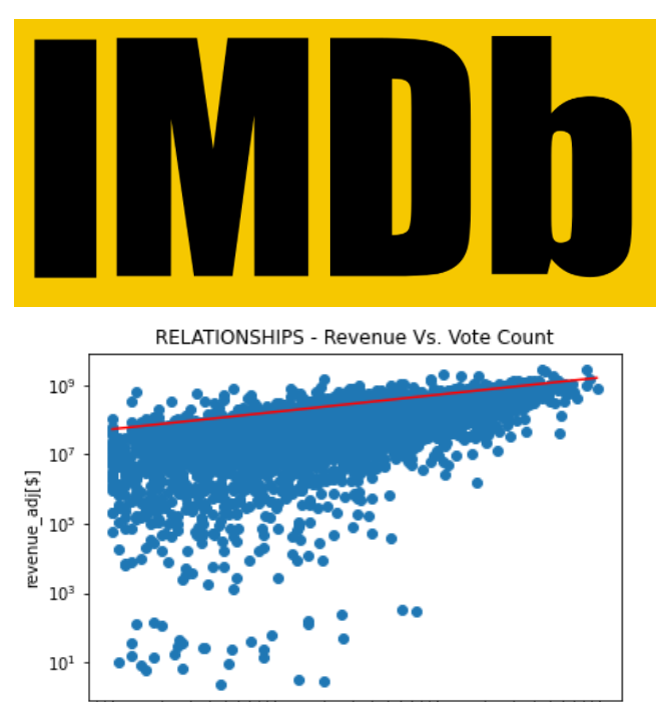

# **Data Analyst Nanodegree** #

# **Project2: Investigate a Dataset** #

# **The Movie Database** #

## **UDACITY Project Info** ##

For the final project, you will conduct your own data analysis and create a file to share that documents your findings. You should start by taking a look at your dataset and brainstorming what questions you could answer using it. Then you should use pandas and NumPy to answer the questions you are most interested in, and create a report sharing the answers. You will not be required to use inferential statistics or machine learning to complete this project, but you should make it clear in your communications that your findings are tentative. This project is open-ended in that we are not looking for one right answer.

## **Dataset** ## 

The Movie Database (TMDb) contains info on 10,000 movies. The dataset size makes it for a very good introductory example for the Nanodegree.

